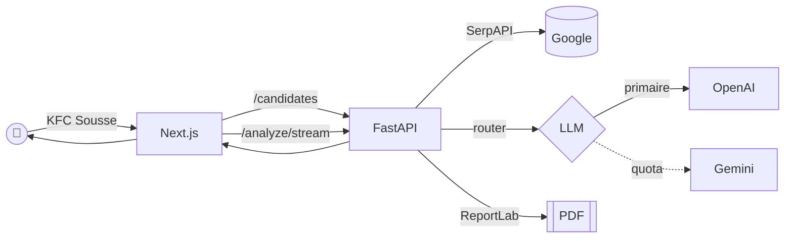
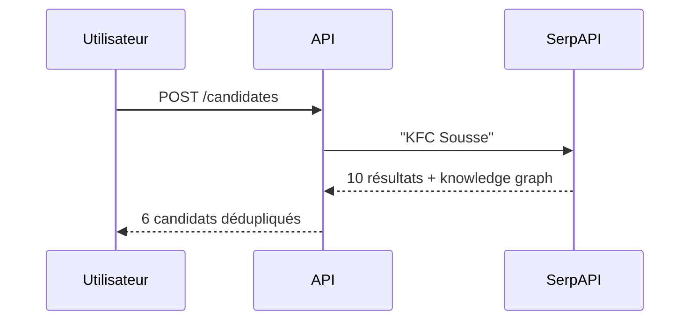
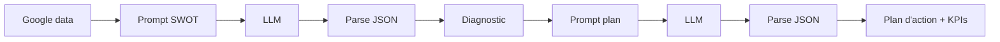
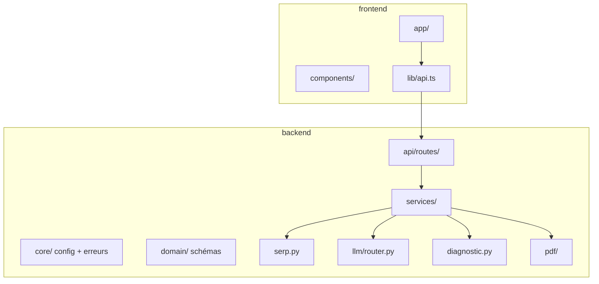

# Localis AI

Tape un nom d'entreprise. On espionne Google. Tu récupères un SWOT, un plan d'action et un PDF.

Projet de fin d'année par **Maram · Anis · Isra · Hiba · Tasnim · Nourhene**. Trois sprints, beaucoup de café.

---

## La vue d'ensemble



---

## Les trois sprints

### Sprint 1 — On déterre les infos

On envoie le nom à **SerpAPI**, on récupère la fiche Google, les avis, les pages qui en parlent. Anis s'en est occupé.



### Sprint 2 — On fait parler l'IA

Deux prompts enchaînés : un pour le SWOT, un pour le plan d'action. Les réponses repassent dans un parseur JSON strict qui refuse les hallucinations. Maram a orchestré, Isra a écrit les prompts, Hiba a nettoyé la sortie, Tasnim a cadré les schémas.



**Le bug du quota**, mentionné dans le commit `000079a` de l'ancien code, est réglé : si OpenAI renvoie 429, le routeur bascule automatiquement sur Gemini.

### Sprint 3 — On emballe le tout

Le diagnostic part dans **ReportLab** pour produire un PDF propre (thème sombre, mascotte Localis, quadrants SWOT colorés). Nourhene a piloté le PDF, la mise en page finale côté web et l'intégration.

---

## L'équipe

| Prénom | Sprint | Terrain de jeu |
| --- | --- | --- |
| **Anis** | 1 | Collecte SerpAPI |
| **Maram** | 2 | Orchestration IA |
| **Isra** | 2 | Prompts |
| **Hiba** | 2 | Nettoyage / parsing |
| **Tasnim** | 2 | Schémas de données |
| **Nourhene** | 3 | Rapport PDF + UI |

---

## Comment on démarre ça

Il faut trois clés API : SerpAPI (Google), OpenAI (LLM principal), Gemini (fallback, optionnel).

```bash
cp .env.example .env   # colle tes clés dedans
docker compose up --build
```

- Web : http://localhost:3000
- API : http://localhost:8000/docs

### Sans Docker

```bash
# backend
cd backend
python -m venv .venv && .\.venv\Scripts\activate
pip install -e ".[dev]"
uvicorn localis.main:app --reload

# frontend (autre terminal)
cd frontend
npm install
npm run dev
```

---

## Tests

```bash
cd backend
pytest
```

33 tests. Couvre le parseur, le routeur LLM (y compris la bascule sur quota), le builder PDF, et le scénario complet `/analyze` mocké.

---

## Architecture côté repo



---

## Ce qu'on ferait ensuite

- Cache des analyses déjà faites (éviter de re-payer le LLM).
- Comparaison côte à côte entre deux entreprises.
- Export Markdown / Notion en plus du PDF.
- Un vrai mode sombre côté impression papier (l'actuel est optimisé écran).
